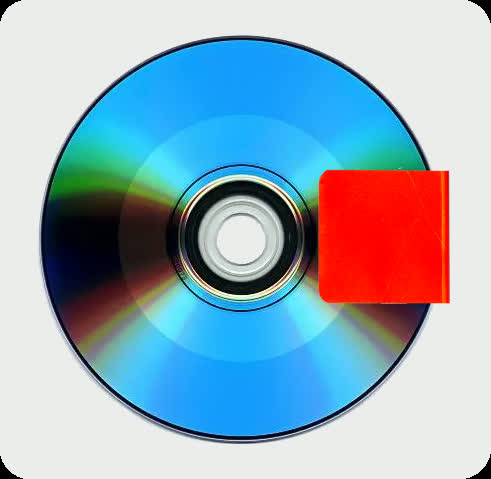
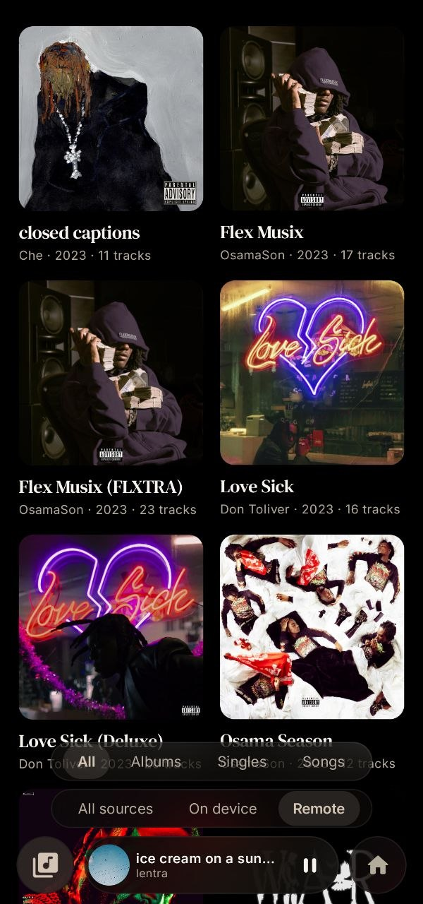
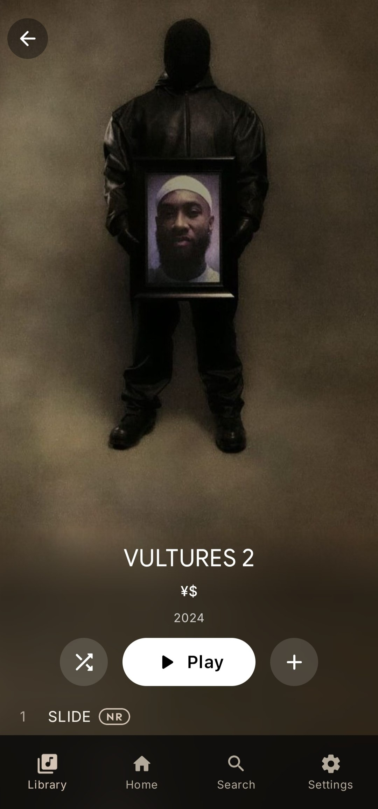
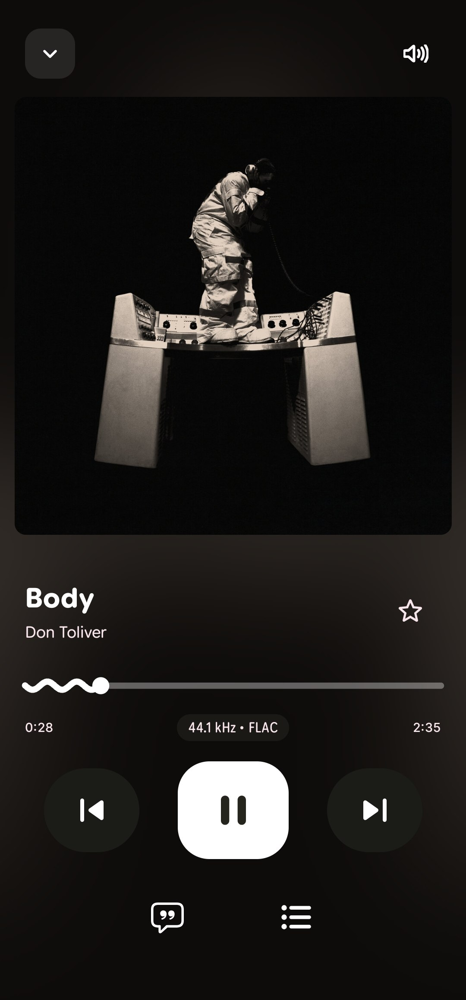
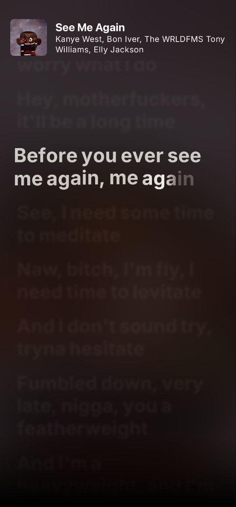

<h1 align="center">starkill</h1>

  <strong>Lightweight Android M3E player with lossless playback</strong> 
  Playful M3E player with animated UI, Apple Music-style lyrics, and remote libraries

  
  
  
  

# Features
- **Lyrics 1:1 Apple Music** _(blur and all effects, supports letter-by-letter lyrics)_
- **Hi-Res Lossless playback**
- **Tag system** _(only trough remote library if supported so)_
- **Playful animated M3E interface** _(Material 3 Expressive)_
- **Remote library & streaming support** _(self hosted library with minimal setup of HTTP server with SSL)_
- **Lightweight** _(by performance && app size)_
- **Build-in libraries for free**
- **Listening statistics** _(how much was spent listening to artist/playlist/track/album per day/weeks/months/all time)_
### Future features _(v1.6, 26-27.09.2026 out date)_
- **Tidal streaming** _(log in Tidal, and stream all of your Tidal music!)_
- **Apple Music streaming** _(not soon, but will be. delayed due requiring Apple Music accounts, actual API to work)_

#### All releases support any Android architecture _(like v8, v7a, x86_64 and other)_

# Other
- [**Self-Hosting Full Guide/Instructions**](SetupSelfHostedSolution.md)
- [**Build-in libraries**](BuildIn_Libraries.md)
