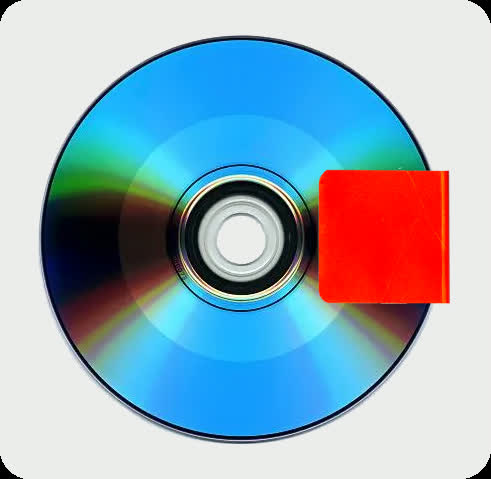
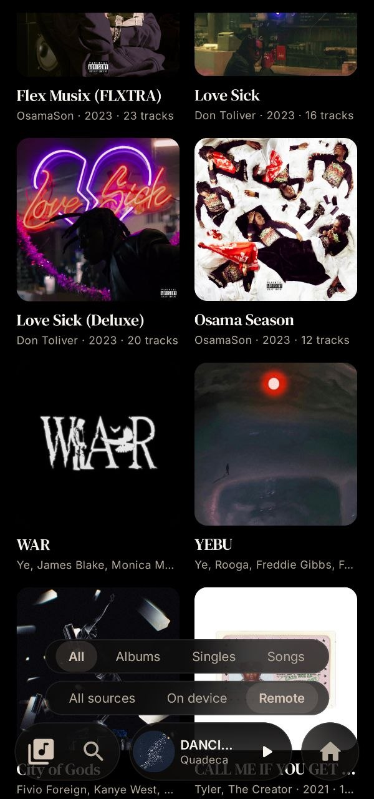
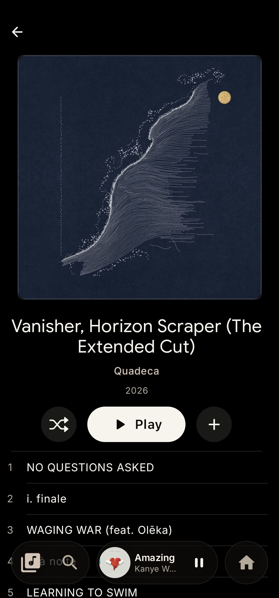
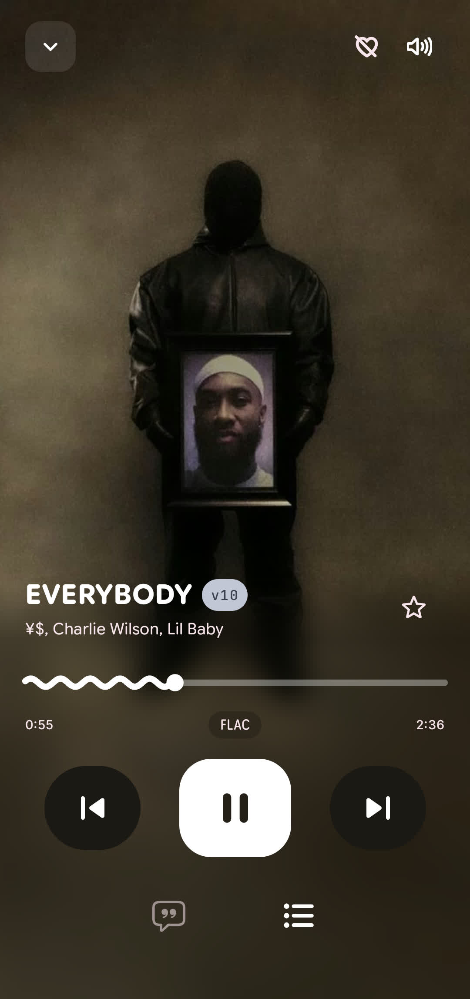
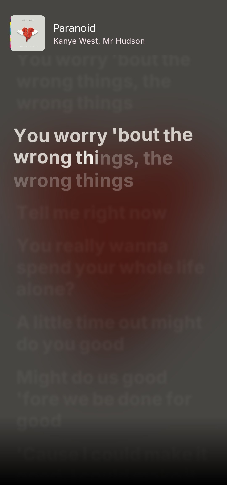

<h1 align="center">starkill</h1>

  <strong>Lightweight Android M3E player with lossless playback</strong> 
  Playful M3E player with animated UI, Apple Music-style lyrics, and remote libraries

  
  
  
  

# Features
- **Build-in library** _(see [build-in libraries](BuildIn_Libraries.md) artists list that are available to stream for free)_
- **Build-in ViPER FX audio processing engine** _(full capabilities of original project, without root)_
- **Music Algorithm** _(artist's Station, "Discover" station; "Autoplay" feature gives capability of recommendations on-device with algorithms by unique properties like related artists, overall playtime and other)_
- **Lyrics 1:1 Apple Music** _(smooth experience, supports letter-by-letter lyrics)_
- **True Hi-Res Lossless playback** _(special function where audio bypasses AudioFlinger's resamping for USB DACs; for Bluetooth and others - still Lossless but with AudioFlinger's resamping)_
- **Tag system** _(only trough remote library if supported so)_
- **Playful animated M3E interface** _(Material 3 Expressive)_
- **Remote library & streaming support** _(self hosted library with minimal setup of HTTP server with SSL)_
- **Lightweight** _(by performance && app size)_
- **Listening statistics** _(how much was spent listening to artist/playlist/track/album per day/weeks/months/all time)_

#### All releases support any Android architecture _(like v8, v7a, x86_64 and other)_

# Other
- [**Self-Hosting Full Guide/Instructions**](SetupSelfHostedSolution.md)
- [**Build-in libraries**](BuildIn_Libraries.md)
- [**LVP Tags Documentation** _(related to Self-Hosting solution, recommended to use with)_](LVP_TagsDocumentation.md)
